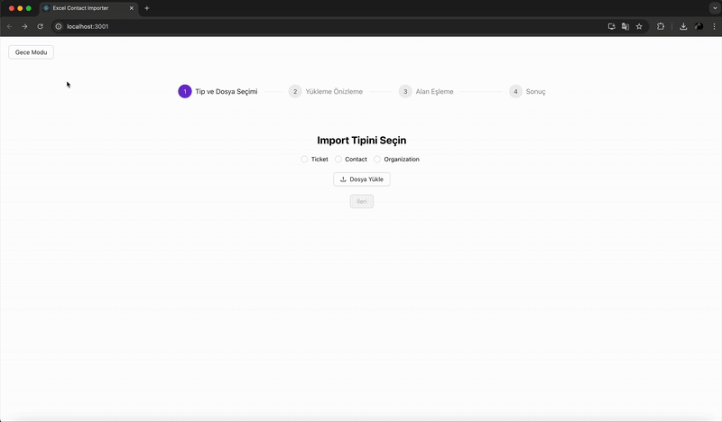

# Excel Contact Importer

**Excel Contact Importer**, Excel dosyalarını (XLSX formatında) okuyarak verileri standart bir formata dönüştürmenizi sağlayan gelişmiş bir web uygulamasıdır.  
Kolon eşleştirme, şablon kullanımı, JSON çıktısı alma, önizleme, **tam entegre gece/gündüz modu** ve **tema özelleştirme** gibi modern özellikler içerir.

---

## Yeni Özellikler

- **Step bazlı sihirbaz (wizard) arayüz**
  Kullanıcılar dosya yükleme, alan eşleştirme ve sonuç görüntüleme adımlarını düzenli bir şekilde takip edebiliyor.
- **Import Tipi Seçimi**
  - Dosya yükleme ekranına tip seçimi eklendi
  - Seçilen tipe göre Alan Eşleme ekranında farklı seçenekler eklendi.
- **Tam Entegre Dark Mode (Gece Modu)**
  - Arka plan ve yazı renkleri otomatik olarak değişir
  - Tüm sayfalarda geçerli olacak şekilde `ConfigProvider` üzerinden uygulanır
- **Tema Özelleştirme**
  - `colorPrimary`, `colorSuccess`, `colorWarning` gibi renkler tek noktadan değiştirilebilir
  - Tüm buton, ikon ve vurgular anında güncellenir
- **Ant Design 5.x ile Tam Uyum**
  - Yeni tema token yapısı kullanıldı
  - `dropdownStyle` ile select menülerine dark mode uyumu
- **Kod Düzenlemeleri & TypeScript İyileştirmeleri**

---

## Özellikler

- XLSX dosyası yükleme
- Kolon eşleştirme (manuel veya şablon kullanarak)
- Şablon kaydetme ve tekrar kullanma
- JSON çıktısını önizleme
- Gece/Gündüz modu desteği
- Tema renklerini tek yerden değiştirme
- JSON çıktısını indirme

---

## Demo



---

## Proje Yapısı

```
excel-contact-importer/
├── backend/              # Node.js (Express) backend API
│   └── routes/
│       ├── upload.ts
│       ├── map.ts
│       └── template.ts
├── frontend/             # React + TypeScript + Ant Design + Zustand frontend
│   └── src/
│       ├── components/
│       ├── App.tsx
│       └── ...
├── .gitignore
├── README.md
└── package.json
```

---

## Kurulum

### 1. Backend

```bash
cd backend
npm install
npm run dev
```

### 2. Frontend

```bash
cd frontend
npm install
npm run dev
```

> Frontend: `http://localhost:3001`  
> Backend API: `http://localhost:3000`

---

## 📦 API Uç Noktaları

| Yöntem | URL                   | Açıklama                 |
| ------ | --------------------- | ------------------------ |
| `POST` | `/api/upload`         | Excel dosyası yükle      |
| `POST` | `/api/map`            | Kolon eşlemesi yap       |
| `GET`  | `/api/template/list`  | Kayıtlı şablonları getir |
| `GET`  | `/api/template/:name` | Şablon detayını getir    |
| `POST` | `/api/template/save`  | Yeni şablon kaydet       |

---

## Kullanım Adımları

1. XLSX dosyasını yükle
2. Kolonları manuel eşle veya bir şablon seç (Manuel olarak oluşturduğun eşleştirme konfigürasyonunu şablon olarak kaydedebilirsin.)
3. Eşleştirme sonucunu önizle
4. JSON çıktısını indir

---

## Kullanılan Teknolojiler

- **Frontend**: React, TypeScript, Ant Design
- **Backend**: Node.js, Express, Multer, XLSX
- **Diğer**: Dark/Light Mode, Vite, Toastify

---

## Katkıda Bulun

Pull request’ler, issue’lar ve öneriler her zaman memnuniyetle karşılanır!  
Projeyi beğendiysen ⭐ vermeyi unutma!

---

## 🧑‍💻 Geliştirici

**Arda Eymen Ulus**  
[GitHub Profilim](https://github.com/ardaeu) | [LinkedIn](https://linkedin.com/in/ardaeu)
